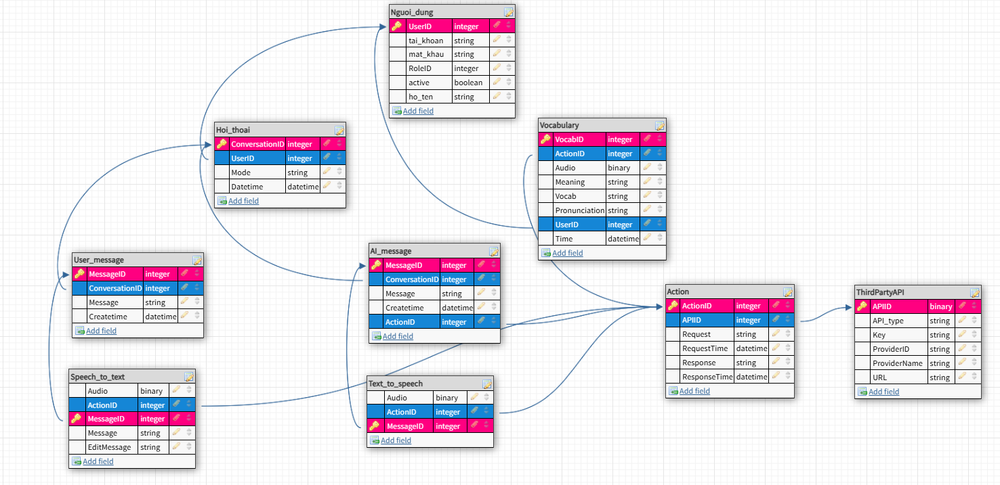

# Đặc Tả Yêu Cầu Phần Mềm — Học Anh Văn Nâng Cao Khả Năng Giao Tiếp

## 1. UseCase Diagram
<figure>
	
	<figcaption>Use Case Diagram — Mô tả các tương tác chính giữa người dùng và hệ thống.</figcaption>
</figure>

User sẽ có 2 chức năng lớn chính là:
- Đối thoại 1-1 bằng tiếng Anh với AI. Trong quá trình đối thoại, có các chức năng theo yêu cầu:
    + Nhận diện giọng nói và chuyển thành văn bản (có thể chỉnh sửa)
    + Chuyển văn bản thành giọng nói để nghe phát âm
    + Khi send văn bản thì sẽ có văn bản trả lời từ AI
    + Có thể bật mode tự động chuyển tất cả thành giọng nói giúp giao tiếp liên tục
- Hỗ trợ học từ vựng
- Hệ thống có sẳn các kết nối với hệ thống khác (Google, OpenAI) cho từng usecase phù hợp

## 2. Class Diagram
<figure>
	
	<figcaption>Class Diagram — Mô tả các lớp chính và mối quan hệ.</figcaption>
</figure>

## 3. Database Design
<figure>
	
	<figcaption>Database Design — Sơ đồ cơ sở dữ liệu.</figcaption>
</figure>

## 4. Thiết kế kiến trúc 3 lớp
<figure>
	
	<figcaption>Thiết kế 3 lớp — Sơ đồ kiến trúc ứng dụng (Presentation, Business, Data).</figcaption>
</figure>
