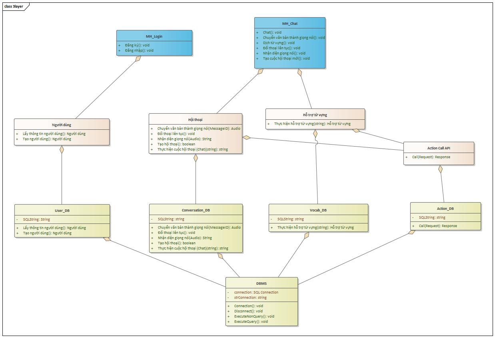

# Đặc Tả Yêu Cầu Phần Mềm — Học Anh Văn Nâng Cao Khả Năng Giao Tiếp

## 1. Mô tả chung
Phần mềm này được thiết kế nhằm mục đích cải thiện khả năng giao tiếp tiếng Anh cho người dùng thông qua một môi trường tương tác trực tiếp, mô phỏng cuộc đối thoại một-kèm-một với hệ thống. Ứng dụng có thể được triển khai trên nền tảng web hoặc dạng app di động.

## 2. Mục tiêu chính
- Người dùng có thể giao tiếp bằng tiếng Anh với hệ thống, sử dụng công nghệ nhận dạng giọng nói (speech-to-text) và mô hình ngôn ngữ lớn (LLM) để tạo ra cuộc đối thoại liên tục và có ý nghĩa.

## 3. Chức năng cơ bản
- Nhận Dạng Giọng Nói:
	- Người dùng đọc câu tiếng Anh, hệ thống sử dụng API nhận dạng giọng nói để chuyển âm thanh sang văn bản.
	- Người dùng có thể chỉnh sửa văn bản nếu cần và sau đó gửi lại cho hệ thống bằng nút "Send".
- Tương Tác Văn Bản Đến Văn Bản:
	- Hệ thống nhận văn bản đã chỉnh sửa, sử dụng API hoặc mô hình ngôn ngữ lớn để phân tích và trả lời bằng văn bản tiếng Anh, phù hợp với ngữ cảnh của cuộc đối thoại.
	- Đưa ra các câu hỏi gợi ý tiếp theo, nhằm thúc đẩy cuộc đối thoại.
	- Cung cấp chức năng chuyển văn bản thành giọng nói (text-to-speech) để người dùng có thể nghe cách phát âm chuẩn.

## 4. Chức năng nâng cao
- Mode auto: Đối thoại liên tục 1-1 không cần bấm nút send.
- Hỗ trợ từ vựng:
	- Nếu người dùng gặp khó khăn với từ vựng hoặc cách phát âm, có thể sử dụng tính năng tra từ điển tích hợp trong ứng dụng hoặc thông qua Google Translate hoặc API tương tự để dịch và học từ mới.
	- Tích hợp khả năng nhấn vào từ ngữ trong văn bản để xem nghĩa và cách phát âm.

## 5. Hình ảnh thiết kế
Các sơ đồ thiết kế đã vẽ được đính kèm dưới đây. Nhấp vào ảnh để mở kích thước đầy đủ.

<figure>
	
	<figcaption>Use Case Diagram — Mô tả các tương tác chính giữa người dùng và hệ thống.</figcaption>
</figure>

<figure>
	
	<figcaption>Class Diagram — Mô tả các lớp chính và mối quan hệ.</figcaption>
</figure>

<figure>
	
	<figcaption>Database Diagram — Sơ đồ cơ sở dữ liệu.</figcaption>
</figure>

<figure>
	
	<figcaption>Thiết kế 3 lớp — Sơ đồ kiến trúc ứng dụng (Presentation, Business, Data).</figcaption>
</figure>

---

Nếu bạn muốn tôi điều chỉnh kích thước ảnh, di chuyển tất cả ảnh vào thư mục `images/` (và cập nhật đường dẫn), hoặc thêm chú thích chi tiết hơn cho từng sơ đồ, cho tôi biết để tôi thực hiện tiếp.
# NMCNPN
